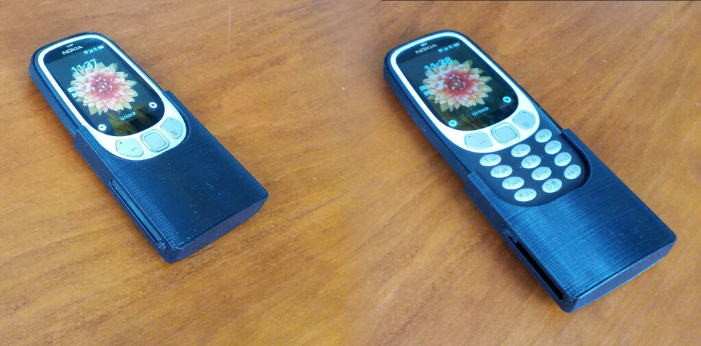

# sliding protection for your Nokia 3310 3G

I kind of like the Nokia 3310 3G: it's small, light and has a decent battery runtime.

However, it happened several times that it started pocket dialling (a.k.a. "butt" calls) the police or the ambulance.

Since I've always been a fan of phones with sliding protection (but the quality of Nokia's banana phone 8110 is actually shockingly bad) I gave it a go myself:

See result here: https://www.thingiverse.com/thing:6287572
